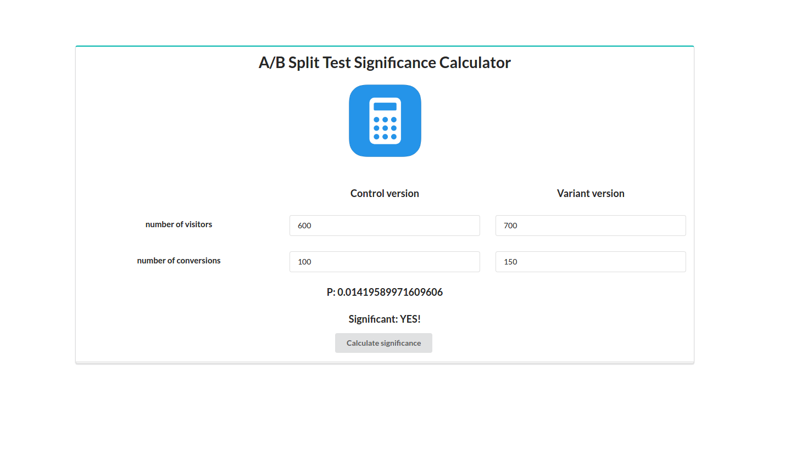

# A/B split test significance calculator.
This is a simple django app for doing A/B split test significance
calculations. It works using numpy and scipy under the hood to perform
the statistical analysis. You can check [this wikipedia article](https://en.wikipedia.org/wiki/A/B_testing)
to get more information about this test.

## Usage
To use the calculator you must provide the number of visitors (or number of samples)
the two versions had (control and variant version) and the number of
conversions that each had (or number of successes that the version had).
The app will calculate the significance of the experiment (the P) and it
will tell you if the result was significant. The app is currently live
at [heroku](https://a-b-test-calculator.herokuapp.com/)

